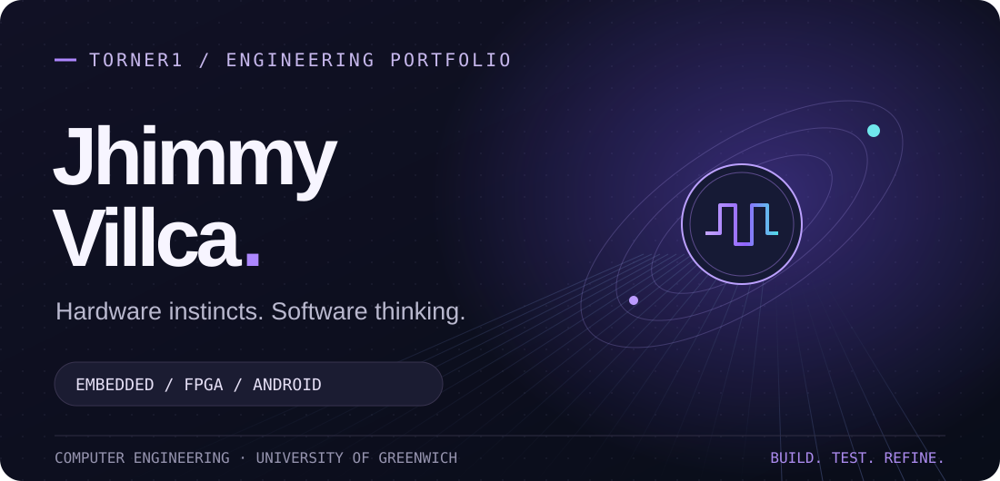
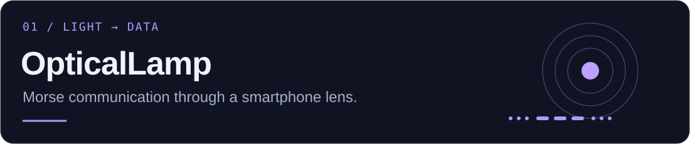
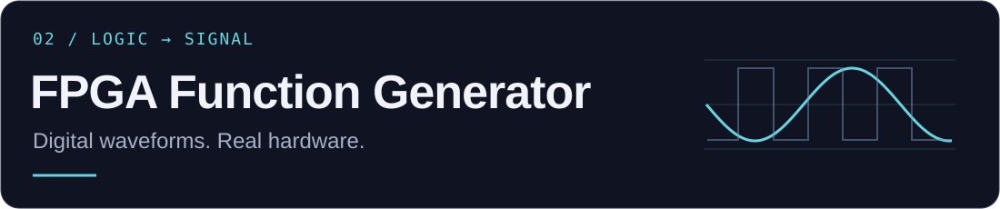

  

  <a href="#about">ABOUT</a> &nbsp; · &nbsp;
  <a href="#selected-work">SELECTED WORK</a> &nbsp; · &nbsp;
  <a href="#toolkit">TOOLKIT</a> &nbsp; · &nbsp;
  <a href="https://github.com/Torner1?tab=repositories">REPOSITORIES ↗</a>

<h2 id="about">A little about the engineer.</h2>

I'm **Jhimmy**, a Computer Engineering graduate from the **University of Greenwich**. I build across digital hardware and software—from FPGA waveforms to Android applications that communicate through light.

I'm interested in **embedded systems, FPGA development and practical software**: understanding how each piece works, then making the pieces work together.

<h2 id="selected-work">Selected work.</h2>

**An Android application exploring optical communication.** Flashlight Morse transmission, adjustable words-per-minute controls and a Jetpack Compose interface. Camera-based reception is the next development focus.

`Kotlin` &nbsp; `Jetpack Compose` &nbsp; `Android` &nbsp; `Optical communication`

<b>Inside the project</b>

- Flashlight-based Morse transmission with speed and stop controls.
- Separate domain, data and interface layers.
- Exploring camera signal detection and adaptive Morse decoding.

 

**A waveform generator implemented on the DE1-SoC.** PWM and sine-wave signals from **10 Hz to 10 kHz**, using a sine lookup table, a TLC7524 DAC and a seven-segment display.

`VHDL` &nbsp; `DE1-SoC` &nbsp; `ModelSim` &nbsp; `Digital electronics`

<b>Inside the project</b>

- Digital waveform generation and DAC interfacing.
- Sine lookup table and seven-segment output.
- Simulation and FPGA implementation.

<h2 id="toolkit">Tools behind the work.</h2>

  
  
  
  
  
  
  

**Hardware:** VHDL · FPGA · DE1-SoC · ModelSim  
**Software:** Kotlin · Jetpack Compose · TypeScript · Next.js · Supabase  
**Workflow:** Git · GitHub · Android Studio · simulation and testing

### Beyond the circuit board

I also work on web applications and workflow automation, with an interest in clear interfaces and maintainable systems.

---

  <b>From the first signal to the finished system.</b> 
  Explore the repositories. Follow the build.

